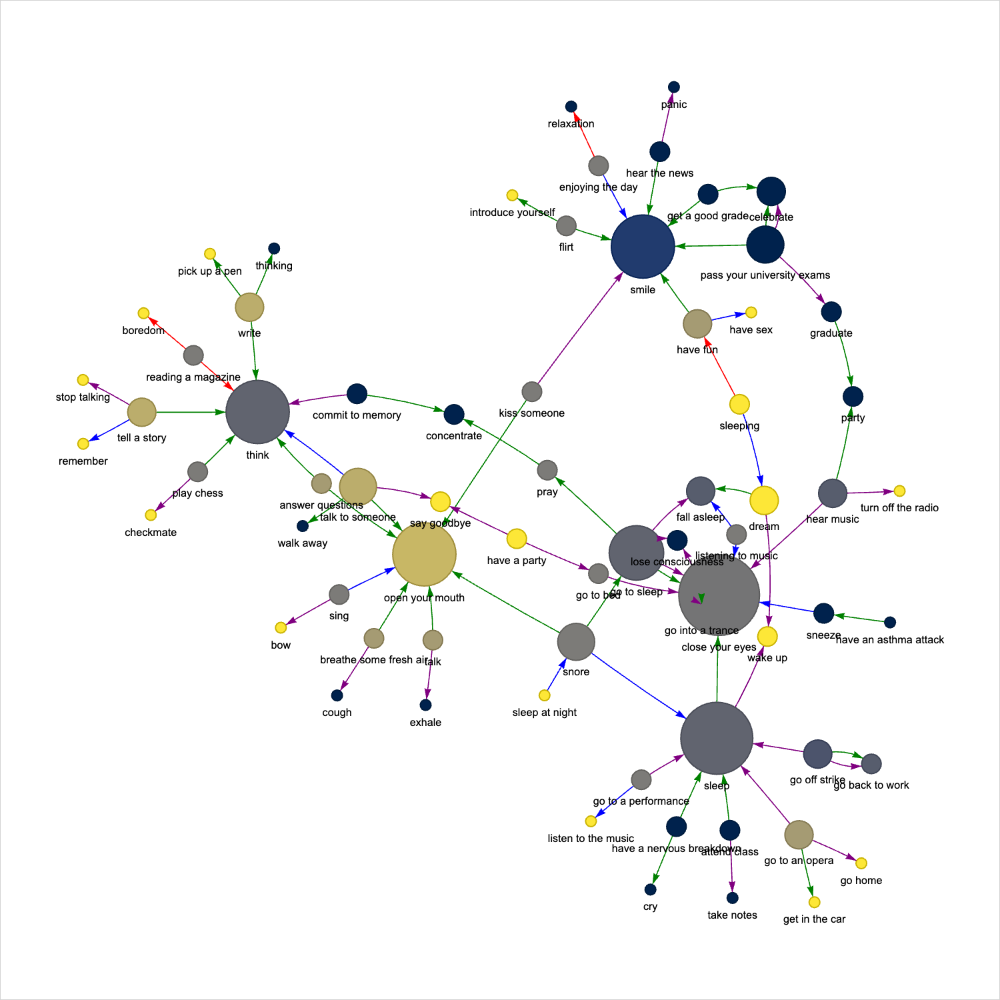
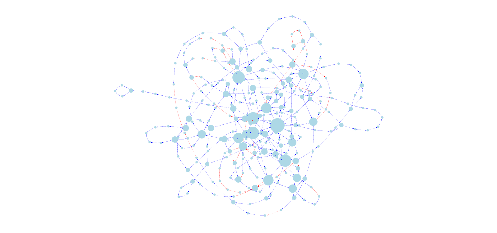
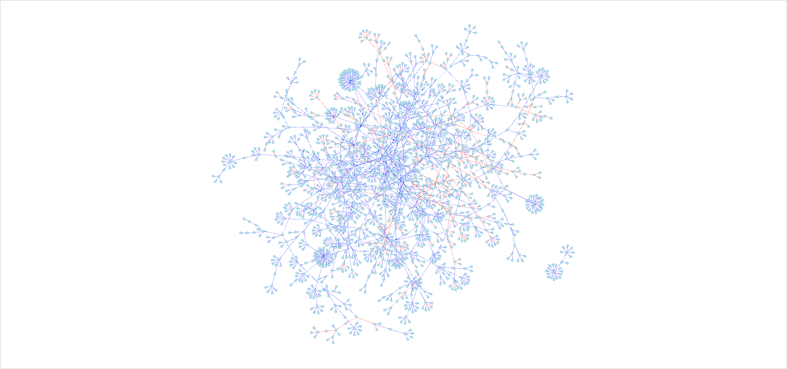
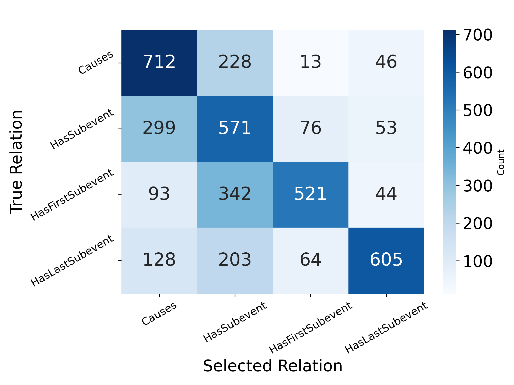

# LLM Event-Relation Classification

Classifying how events relate to one another with language models, then examining the predictions as a semantic network.

**Knowledge Processing seminar, University of Hamburg | 2024–2025 team project**

Does one event cause another, contain it as a subevent, or begin or end with it? This project uses ConceptNet event pairs to study that distinction through definition-based prompting, three-sample classification, tie-breaking and graph-based error analysis.

I implemented data collection, prompt construction and relation generation, evaluation comparisons, and semantic-network visualization. The project was developed with Abdullah Abdelhafez; the retained Git history also records his work on comparison and error-analysis utilities. See [project context and contributions](docs/project.md).

## What the project contains

- **Event-relation pipeline:** ConceptNet collection, structured prompts, three model responses per pair, exact-label voting and a candidate-restricted tie-break.
- **Evaluation:** precision, recall, macro F1, confusion matrices and paired comparisons, with invalid predictions retained in the denominator.
- **Semantic-network analysis:** concept-ID-based graphs, parallel relation edges, k-core filtering and bounded neighborhood exploration.
- **Reproducibility:** 3,999 archived prediction records, original prompts, source hashes, offline tests and resumable opt-in generation.

The archived experiment requested `gpt-4o` through an OpenAI-compatible third-party endpoint. The saved records do not identify an immutable model snapshot. It was a prompting experiment, not model training or fine-tuning.

## Source code and execution

The repository includes both the complete seminar implementation and the tested command-line modules. The CLI reuses the seminar's prompt library; code, datasets and saved outputs are linked separately so the implementation is easy to inspect.

| Stage | Seminar implementation | Runnable modules |
| --- | --- | --- |
| Collect event pairs | [data_collector.py](pipeline/data_collector.py) | [collector.py](event_relations/collector.py) |
| Construct prompts and classify | [prompt_library.py](pipeline/prompt_library.py), [generator.py](pipeline/generator.py) | [generation.py](event_relations/generation.py), [runner.py](event_relations/runner.py) |
| Evaluate predictions | [evaluator.py](pipeline/evaluator.py) | [evaluation.py](event_relations/evaluation.py) |
| Analyze and visualize graphs | [visualizer.py](pipeline/visualizer.py) and [variants](pipeline/README.md) | [graph.py](event_relations/graph.py) |
| Inspect errors | [filter.py](pipeline/filter.py), [merge.py](pipeline/merge.py), [random_filter.py](pipeline/random_filter.py), [analyzer.py](pipeline/analyzer.py) | [Run the original error analyzer](pipeline/README.md#run-the-project) |

See the [complete source map and compatibility notes](pipeline/README.md) for all implementations, including the exploration notebook. Exact duplicate source files are consolidated, not omitted without a mapping.

## Results in context

| Evaluation strategy | Accuracy | Macro F1 | Invalid predictions |
| --- | ---: | ---: | ---: |
| Strict first response | 59.54% | 0.6038 | 4 |
| Historical first-response evaluation, with fallback | 59.59% | 0.6039 | 0 |
| Multi-sampling selection | 60.24% | 0.6099 | 0 |

Multi-sampling produces a modest improvement. The more useful finding is the error structure: the model often assigns the broad `HasSubevent` label where ConceptNet distinguishes causal, initial or final subevents. These scores measure agreement with the archived ConceptNet labels, not universally correct semantic judgments. [Detailed results and limitations](docs/results.md)

## Original experiment outputs

### Semantic-network visualizations

The screenshots below show the saved HTML visualizations rendered in Chrome. The original graph data, colors and styles are retained; the view is fitted to the canvas after layout stabilization. Click an image for its full-resolution PNG.

**Filtered event neighborhood: 69 nodes, 82 edges**



[Original interactive HTML](artifacts/original/semantic-networks/visualizations/Filtered%20Semantic%20Network.html)

| K-core view, k = 2: 278 nodes, 353 edges | Connected-event overview: 1,978 nodes, 2,064 edges |
| --- | --- |
|  |  |
| [Interactive HTML](artifacts/original/semantic-networks_total/visualizations/K-core%20Semantic%20Network%28k%3D2%29.html) | [Interactive HTML](artifacts/original/semantic-networks_total/visualizations/Original%20Semantic%20Network%20of%20Connected%20Events.html) |

These are saved views with different scopes and display settings, not separate experiments. Dense overviews show network structure; use the HTML for zooming and individual-node inspection. [All five screenshots and source files](artifacts/README.md#saved-semantic-network-visualizations)

### Evaluation figure



The figure above is the original saved output, not a replacement plot. Its known one-record discrepancy is explained in the [results audit](docs/results.md).

Open the [original workflow and results catalog](artifacts/README.md) to inspect the collection, generation checkpoints, error-analysis outputs and five saved semantic-network views. Start with the [original evaluation workbook](artifacts/original/semantic-networks/result/Evaluation%20Scores.xlsx) or the [connected-event graph HTML](artifacts/original/semantic-networks_total/visualizations/Original%20Semantic%20Network%20of%20Connected%20Events.html). Download the repository and open HTML files locally; GitHub does not run them inline.

## Try it without an API key

Python 3.10 or newer. Evaluation and graph JSON export require no installed packages, credentials or network access. Run these commands from the repository root:

```bash
python3 -B -m event_relations evaluate data/predictions.json
python3 -B -m event_relations graph data/predictions.json --labels selected --k 2 --hops 2
python3 -B -m unittest discover -s tests -v
python3 -B tools/verify_repository.py
```

For optional model generation and interactive Pyvis visualization, see [usage](docs/usage.md). Generation requires explicit opt-in, reads credentials from the environment and checkpoints completed pairs. No paid model calls are part of the tests.

## Explore

- [Project context](docs/project.md): research question, contributions and technology choices.
- [Method and implementation](docs/method.md): relation definitions, sampling, graph conventions and implementation fixes.
- [Results](docs/results.md): all evaluation strategies and the difference between stored figures and recomputed metrics.
- [Data and provenance](docs/data.md): dataset sizes, duplicates, source versions and publication decisions.
- [Usage](docs/usage.md): commands, checkpoint behavior and optional dependencies.
- [Complete seminar source](pipeline/README.md): collection, generation, evaluation, graph variants, error analysis and exploration code; credentials replaced by `xxx`.

This work includes ConceptNet-derived data under [CC BY-SA 4.0](https://creativecommons.org/licenses/by-sa/4.0/). Attribution, team-code ownership and data limitations are described in [rights and attribution](RIGHTS_AND_ATTRIBUTION.md). Some commonsense assertions contain offensive or sensitive language; their inclusion is not an endorsement.
